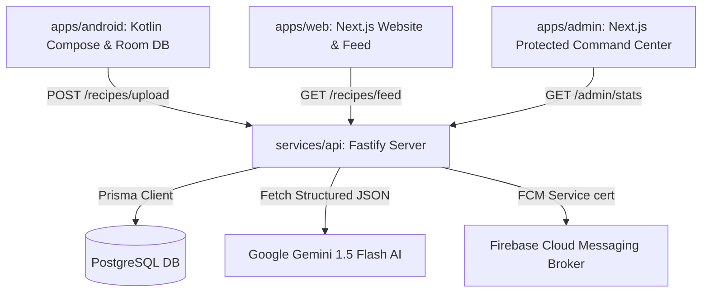

# RecipeBook Full-Stack Monorepo Ecosystem

RecipeBook is a state-of-the-art AI-powered recipe extraction platform that automatically cleans, validates, and publishes recipes uploaded from user screenshots or photos. 

The ecosystem is structured in a high-performance **npm workspaces monorepo** containing five core codebases, deployment configurations, and automated CI/CD pipelines.

---

## 🏗️ Ecosystem Architecture



---

## 📂 File Directory Map

- **`apps/android`**: Native Android Studio app written in Kotlin with Jetpack Compose (Material 3), SQLite Room DB caching, Google ML Kit OCR scanner, and background queue sync systems.
- **`apps/web`**: Next.js community landing site and community feed containing interactive recipe detailed pages and dynamic ingredient scaling multipliers.
- **`apps/admin`**: Protected Next.js administration command center displaying telemetry stats, live feature flags, FCM broadcasters, and side-by-side recipe diff review moderation queues.
- **`services/api`**: Node.js + TypeScript Fastify server with Prisma Client, rate-limiting, Helmet headers security, JWT auth, and the Gemini parser pipeline.
- **`packages/shared`**: Shared validation schemas (Zod) and TypeScript types sharing interfaces between all JavaScript clients.
- **`packages/ui`**: Shared design tokens and Tailwind CSS presets.

---

## 🚀 Local Development Quickstart

### 1. Repository Installation
Clone the repository and install all root and package dependencies at once:
```bash
npm install
```

### 2. Configure Environment Variables
Copy `.env.example` configurations into live variables.

- Root Environment: [recipebook/.env.example](file:///C:/Users/dawoo/.gemini/antigravity-ide/scratch/recipebook/.env.example)
- API Environment: [services/api/.env.example](file:///C:/Users/dawoo/.gemini/antigravity-ide/scratch/recipebook/services/api/.env.example)

### 3. Setup Database Schema & Seeding
Prisma config is configured out-of-the-box. Run migrations and database seeds:
```bash
# Generate Prisma clients bindings
npm run prisma:generate

# Execute seeding scripts populating initial admins, features flags, and recipes
npm run prisma:seed
```

### 4. Running Development Servers
Spawn all servers concurrently or individually:
```bash
# Concurrently launch API, Web App and Admin Dashboard
npm run dev:api    # Launches Fastify on http://localhost:5000
npm run dev:web    # Launches Next.js Web on http://localhost:3000
npm run dev:admin  # Launches Next.js Admin on http://localhost:3001
```

---

## 🐳 Docker Orchestration

You can spin up the entire cloud architecture instantly (Database, Redis caching, Fastify API, Web App, and Admin Commands dashboard) using Docker Compose:

```bash
# Build and run containers
docker-compose up --build
```
This boots:
- PostgreSQL DB on `localhost:5432`
- Redis cache on `localhost:6379`
- Fastify API on `localhost:5000`
- Web Application on `localhost:3000`
- Admin Command Center on `localhost:3001`

---

## 📱 Native Android App Setup & Compilation

The native Android app uses **Kotlin**, **Jetpack Compose**, and follows the modern recommended Android Clean Architecture patterns:

1. Open the [apps/android](file:///C:/Users/dawoo/.gemini/antigravity-ide/scratch/recipebook/apps/android) folder inside **Android Studio**.
2. Wait for Gradle Sync to complete. All dependencies (Room, Hilt, ML Kit, FCM, Retrofit) are mapped out-of-the-box in `build.gradle.kts`.
3. To compile and run on emulator or physical phone, click **Run > Run 'app'**.
4. To build the final deployable package:
   ```bash
   ./gradlew assembleRelease
   ```
   The compilable APK will build and save under `app/build/outputs/apk/release/`.

---

## ☁️ Production Cloud Deployments

### 1. Deploy API Server to Google Cloud Run
Our Fastify container fits perfect inside GCP Serverless scaling architectures:
```bash
# Build Google container image
gcloud builds submit --tag gcr.io/your-project-id/recipebook-api

# Deploy to Cloud Run (Specify envs during prompt or load via config)
gcloud run deploy recipebook-api \
    --image gcr.io/your-project-id/recipebook-api \
    --platform managed \
    --allow-unauthenticated \
    --port 5000
```

### 2. Deploy Web and Admin Frontends to Vercel
Both frontend codebases are ready for Vercel Serverless routing:
```bash
# Install vercel cli
npm i -g vercel

# Deploy Public Website
cd apps/web
vercel

# Deploy Command dashboard
cd apps/admin
vercel
```

---

## 🛡️ Administrative Defaults
- **Admin Email**: `soli@recipebook.com`
- **Admin Password**: `Soliman@1234`
*(Default login triggers automatic routing to protected admin panels, utilizing server-side JWT verification checks.)*
